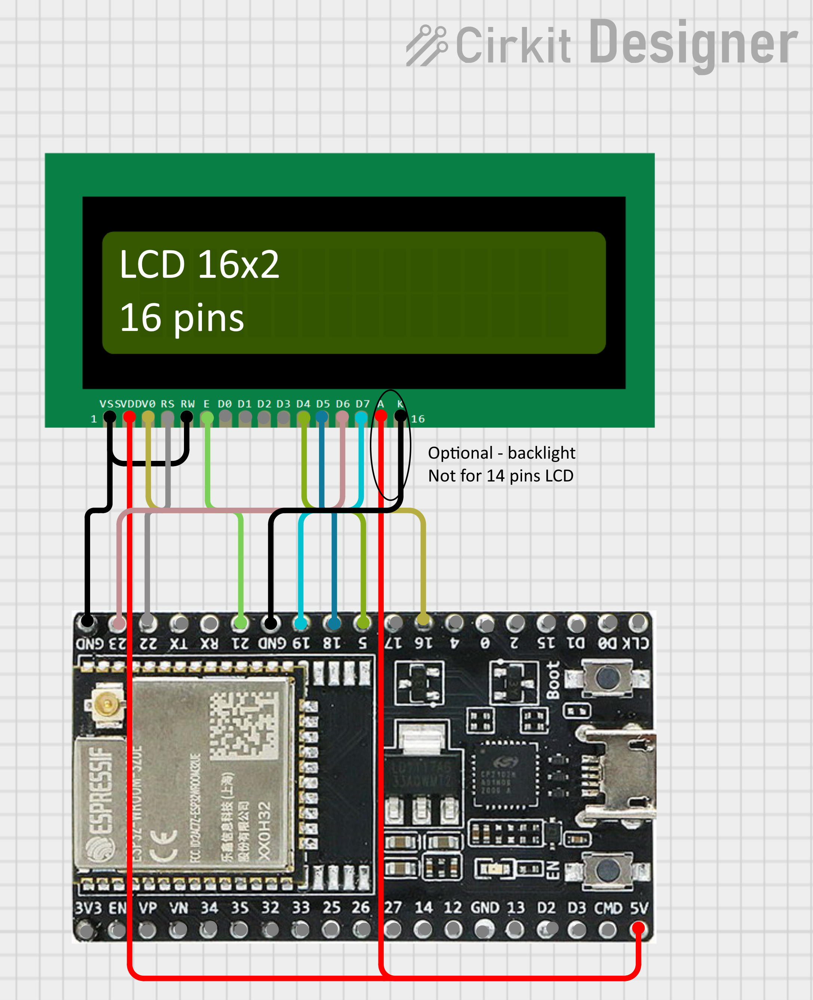
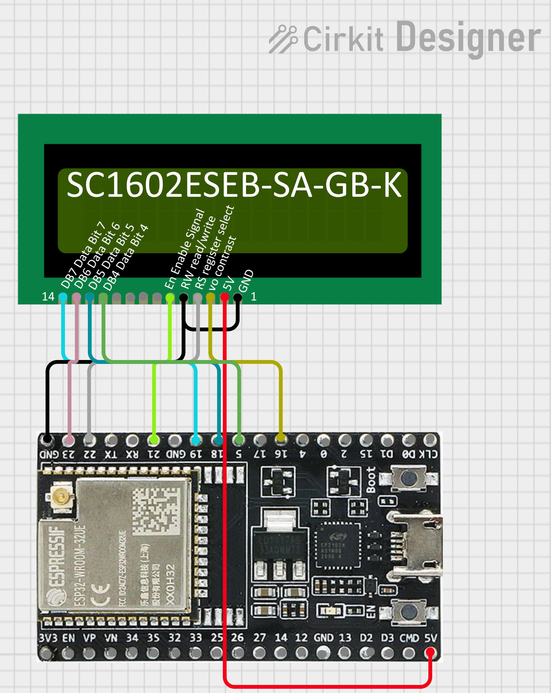

# ESP32-LCD-NightScout
Display NightScout data on 16x2 LCD screen connected to an ESP32

### ESP32 flashing and setup

Download the code on GitHub.

Install and select the "ESP32 dev module" board in Arduino.

Install the libraries:
- ArduinoJson-6.21.5 https://www.arduino.cc/reference/en/libraries/arduinojson/

- LiquidCrystal 1.0.7 https://www.arduino.cc/reference/en/libraries/liquidcrystal/

- WiFiManager 2.0.17 https://github.com/tzapu/WiFiManager

Flash the code using Arduino IDE. You might need to press "Boot" button of the ESP32 to flash your board.

Use your phone or computer to connect to the Gluci-clock Wi-Fi network. The password will be displayed on the LCD as well as printed on the serial monitor.

Follow the instructions, you will have to enter:
- Your Wi-Fi password
- The URL of your NightScout API, which should end with this chain: "/api/v1/entries.json?count=1" (an example is: "https://your-nightscout-site/api/v1/entries.json?count=1")
- Your NightScout API key, with "API read" rights. This is defined in the hamburger menu of NightScout, in the Admin Tools section.
- Your local timezone parameters, which can be found at this address: https://github.com/nayarsystems/posix_tz_db/blob/master/zones.csv
- The contrast level for your LCD

You shouldn't need to change the other parameters.

If you need to return to this interface, just click multiple times on the reset button of the ESP32, and Gluci-clock will open its own Wi-Fi configuration network.

### Materials needed:

#### ESP32 development module:

AZDelivery ESP32 NodeMCU module WLAN Wifi Dev Kit C (with CP 2102)

https://amzn.eu/d/8uNnGYs

#### LCD screen: I used an old 16 by 2 screen from my DIY box...

#### Cables

### Wiring

| 16x2 LCD pins (right to left) |  ESP32 pins  |
| ----------------------------- | ------------ |
| 1 GND supply                  |     GND      |
| 2 VDD 5v                      |      5V      |
| 3 Vo contrast adjustment      |   16 (PWM)   |
| 4 RS register select          |      22      |
| 5 R/W read/write              |     GND      |
| 6 En Enable Signal            |      21      |
| 7 DB0 Data Bit 0              |    unused    |
| 8 DB1 Data Bit 1              |    unused    |
| 9 DB2 Data Bit 2              |    unused    |
|10 DB3 Data Bit 3              |    unused    |
|11 DB4 Data Bit 4              |       5      |
|12 DB5 Data Bit 5              |      18      |
|13 DB6 Data Bit 6              |      23      |
|14 DB7 Data Bit 7              |      19      |
|15 +5V backlight optional      |(16 pins LCDs)|
|16 GND backlight optional      |(16 pins LCDs)|

Wiring with a traditional 16 by 2 LCD:

Wiring with an old SC1602ESEB-SA-GB-K LCD:

### Development environment
Arduino IDE version 1.8.19

Card: ESP32 dev module

https://github.com/espressif/arduino-esp32

Upload speed: 921600

CPU frequency: 240 MHZ

Flash frequency: 80 MHZ

Flash mode: QIO

Flash size: 4 Mbits

Partition scheme: default 4MB with spiffs

Core debug level: None

PSRAM: disabled

Arduino Runs On: Core 1

Events Runs On: Core 1

Erase Flash Before Sketch Upload: disabled

JTAG Adapter: disabled

Programmer: Esptool

