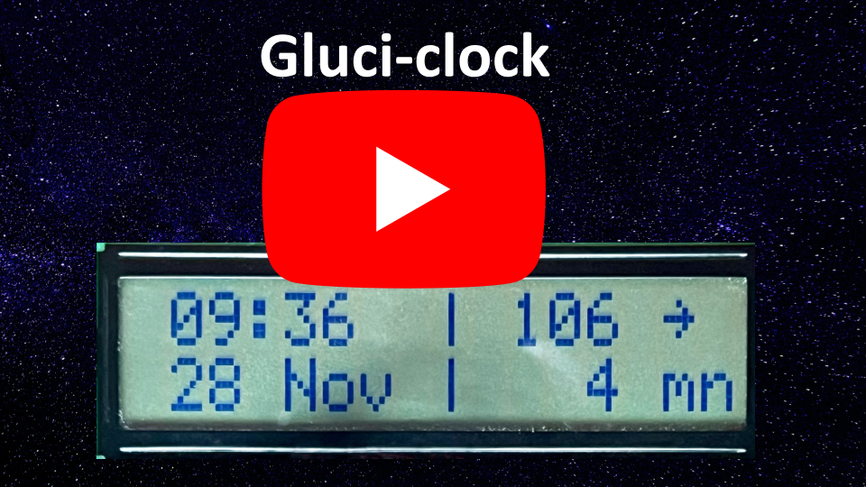

# ESP32-LCD-NightScout
Display NightScout data on 16x2 LCD screen connected to an ESP32

### ESP32 flashing and setup

Download the code on GitHub: https://github.com/Frederic1000/gluci-clock

Open code in Arduino (version 1) IDE

Install board (Tools > Board > Board Manager): ESP32 2.0.17 by Espressif Systems, **do not use 3.x and over versions.**

Select the "ESP32 dev module" board in Arduino.

Install the libraries (Tools > Manage Libraries):
- ArduinoJson 7.2.1 by Benoit Blanchon https://www.arduino.cc/reference/en/libraries/arduinojson/

- WifiManager 2.0.17 by Tablatronix https://github.com/tzapu/WiFiManager

- ESP_DoubleResetDetector 1.3.2 by Khoi Hoang https://www.arduinolibraries.info/libraries/esp_double-reset-detector

Flash the code using Arduino IDE. You might need to press the "Boot" button of the ESP32 to flash your board.

Use your phone or computer to connect to the Gluci-clock Wi-Fi network. The password will be displayed on the LCD as well as printed on the serial monitor. The IP is 192.168.4.1.

Follow the instructions, you will have to enter:
- Your Wi-Fi password
- The URL of your NightScout API, which should end with this chain: "/api/v1/entries.json?count=1" (an example is: "https://your-nightscout-site/api/v1/entries.json?count=1")
- Your NightScout API key, with "API read" rights. This is defined in the hamburger menu of NightScout, in the Admin Tools section
- Your local timezone parameters, which can be found at this address: https://github.com/nayarsystems/posix_tz_db/blob/master/zones.csv
- The contrast level for your LCD

You shouldn't need to change the other parameters.

The configuration portal should be lanched automatically at power-up, then the program will run after a few minutes. If you need to force returning to this interface, just click multiple times on the reset button of the ESP32, and Gluci-clock will open its own Wi-Fi configuration network.

### Materials needed:

#### ESP32 development module:

I used an AZDelivery ESP32 NodeMCU module WLAN Wifi Dev Kit C (with CP 2102).

https://amzn.eu/d/8uNnGYs

#### LCD screen: I used an old 16 by 2 screen from my DIY box...

#### Cables

### Wiring

| 16x2 LCD pins (right to left) |  ESP32 pins  |
| ----------------------------- | ------------ |
| 1 GND supply                  |     GND      |
| 2 VDD 5v                      |      5V      |
| 3 Vo contrast adjustment      |   16 (PWM)   |
| 4 RS register select          |      22      |
| 5 R/W read/write              |     GND      |
| 6 En Enable Signal            |      21      |
| 7 DB0 Data Bit 0              |    unused    |
| 8 DB1 Data Bit 1              |    unused    |
| 9 DB2 Data Bit 2              |    unused    |
|10 DB3 Data Bit 3              |    unused    |
|11 DB4 Data Bit 4              |       5      |
|12 DB5 Data Bit 5              |      18      |
|13 DB6 Data Bit 6              |      23      |
|14 DB7 Data Bit 7              |      19      |
|15 +5V backlight optional      |(16 pins LCDs)|
|16 GND backlight optional      |(16 pins LCDs)|

Wiring with a traditional 16 by 2 LCD:

Wiring with an old SC1602ESEB-SA-GB-K LCD:

### Development environment
Arduino IDE version 1, not tested with Arduino 2

Card: ESP32 dev module

https://github.com/espressif/arduino-esp32

Upload speed: 921600 (default)

CPU frequency: 240 MHZ (default)

Flash frequency: 80 MHZ (default)

Flash mode: QIO (default)

Flash size: 4 Mbits (default)

Partition scheme: default 4MB with spiffs

Core debug level: None (default)

PSRAM: disabled (default)

Arduino Runs On: Core 1 (default)

Events Runs On: Core 1 (default)

Erase Flash Before Sketch Upload: disabled (default)

JTAG Adapter: disabled (default)

Programmer: Esptool

### Wishlist

- In the loop: update time first then NightScout data, so that time is always correct event if NightScout doesn't respond.

